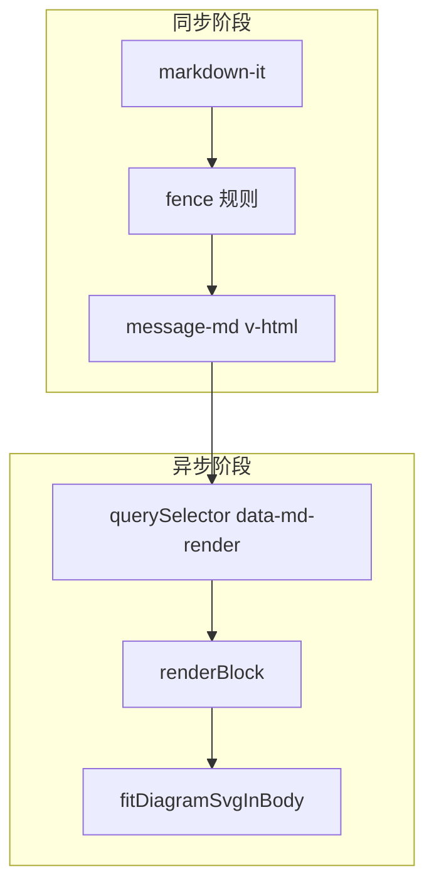

# 架构与流程

## 总览



1. **`renderMarkdown(markdown)`**：`markdown-it` 将 Markdown 转为 HTML 字符串；围栏图表不直接绘图，只输出带 `data-md-render` 的占位 DOM。
2. **`renderMarkdownBlocks(root, options)`**：在 `root` 内查找占位块，按类型调用 Mermaid / PlantUML / vega-embed / iframe 填充内容，再适配 SVG 尺寸。

## markdown-it 配置

文件：`src/utils/markdownRenderer.ts`

| 选项 | 值 | 说明 |
|------|-----|------|
| `html` | `false` | 禁止原始 HTML 注入（除 `html` 围栏走 iframe） |
| `linkify` | `true` | 自动链接 |
| `typographer` | `true` | 排版优化 |

自定义 renderer 规则：

- **fence**：识别 `html` / `mermaid` / `plantuml` / `puml` / `vega-lite` / `vegalite`，其余走默认高亮 `pre`
- **table**：外包 `md-table-wrap`，表头/单元格加 `md-*` 类名
- **link**：`target="_blank"` + `rel="noopener noreferrer"`
- **paragraph**：统一行高 CSS 变量

## 围栏类型

| 语言标识 | `data-md-render` | 占位 class | 渲染函数 |
|----------|------------------|------------|----------|
| `mermaid` | `mermaid` | `md-diagram-mermaid` | `renderMermaidBlock` |
| `plantuml` / `puml` | `plantuml` | `md-diagram-plantuml` | `renderPlantUmlBlock` |
| `vega-lite` / `vegalite` | `vegalite` | `md-diagram-vegalite` | `renderVegaLiteBlock` |
| `html` | `html` | `md-html-block` | `renderHtmlPreviewBlock` |

源码保存在隐藏节点 `<pre class="md-diagram-source" hidden>` 中，避免 `v-html` 转义问题。

## 异步渲染与去重

每个块维护属性：

- `data-md-rendering`：渲染进行中
- `data-md-rendered="true"`：已完成，跳过重复渲染

`renderMarkdownBlocks` 对块 `Promise.all` 并行渲染，结束后调用 `refitDiagramBlocksInRoot` 统一重算 SVG 外框。

## 流式输出（deferDiagrams）

`ChatView.vue` 在以下时机调用 `renderMarkdownBlocks`：

```ts
renderMarkdownBlocks(root, { deferDiagrams: isBusyByState.value })
```

当 `deferDiagrams: true`（WebSocket 仍在 busy 段）时，**跳过** mermaid / plantuml / vegalite，占位仍显示「图表生成中…」。流式结束（`isBusyByState` 变 false）或 `messageContext` 变化后再次调用，补全图表。

这样可避免 LLM 未写完围栏时 Mermaid 解析失败或频繁重绘。

## Mermaid 初始化

懒加载 `import('mermaid')`，`initialize` 要点：

- `startOnLoad: false`
- `securityLevel: 'strict'`
- `suppressErrorRendering: true`（错误不插入默认「炸弹」SVG）
- 自定义 `themeVariables` / `themeCSS`（浅色可读）

渲染前执行 `normalizeMermaidSource`（弯引号、pie 标签引号、xychart 横向修正等）。

## 导出 API

| 函数 | 用途 |
|------|------|
| `renderMarkdown` | 同步 HTML |
| `renderMarkdownBlocks` | 异步图表 |
| `refitDiagramBlocksInRoot` | 侧栏宽度变化后重算 SVG 框 |
| `resetMarkdownRendererForTest` | 测试重置单例 |
